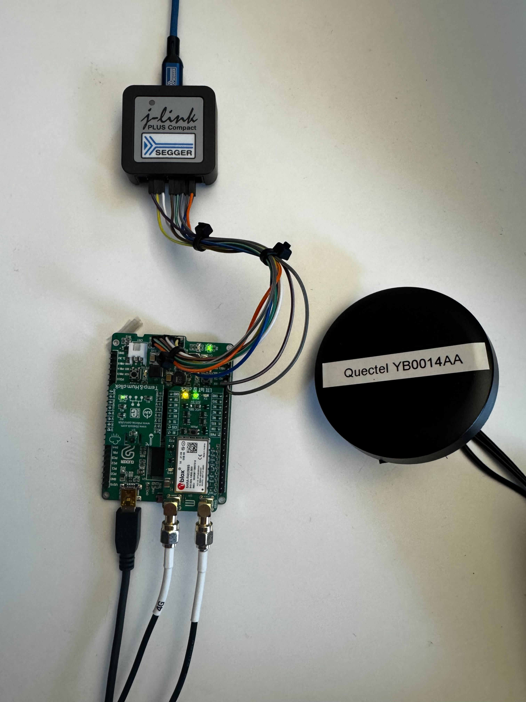

# Seven Clicker Sample

This is an end-to-end Internet of Things (IoT) sample project which collects
data from a temperature and humidity sensor, and publishes it to AWS IoT Core
MQTT broker using mobile connectivity (LTE).

The project is based on [Zephyr Project](https://zephyrproject.org/) and
hardware from [MIKROE](https://www.mikroe.com/).

## Hardware

Hardware used in this project:

* [J-Link PLUS Compact](https://shop.segger.com/debug-trace-probes/debug-probes/j-link/j-link-plus-compact)
* [MIKROE - CLICKER FOR STM32](https://www.mikroe.com/clicker-2-stm32f4)
* [MIKROE - LTE IOT 7 CLICK](https://www.mikroe.com/lte-iot-7-click)
* [MIKROE - TEMP&HUM CLICK](https://www.mikroe.com/temp-hum-click)

You also need:

* Micro-B USB cable
* SIM card with a data plan
* J-Link PLUS Compact adapter for the
  [CLICKER FOR STM32](https://www.mikroe.com/clicker-2-stm32f4) JTAG connector

<p align="center">
  
</p>

## Getting Started

### Prerequisites

Before getting started, make sure you have a proper Zephyr development
environment:

* [Zephyr - Install Linux Host Dependencies](https://docs.zephyrproject.org/latest/develop/getting_started/installation_linux.html#installation-linux)
* [Zephyr - Install Zephyr SDK](https://docs.zephyrproject.org/latest/develop/toolchains/zephyr_sdk.html#toolchain-zephyr-sdk)

### Setup project

Create workspace and change in to it:

```
mkdir -p ~/src/seven-clicker-sample-workspace && cd ~/src/seven-clicker-sample-workspace
```

Create Python virtual environment:

```
python -m venv .venv
```

Active Python virtual environment:

```
. .venv/bin/activate
```

Install west:

```
pip install west
```

Initialize workspace:

```
west init -m https://github.com/id8-engineering/seven-clicker-sample --mr main .
```

Change directory:

```
cd seven-clicker-sample
```

Fetch and checkout sources:

```
west update
```

Install Python dependencies:

```
west packages pip --install
```

Change directory:

```
cd seven-clicker-sample
```

### Build firmware

```
west build -p always -b mikroe_clicker_2 app \
    -DCONFIG_MODEM_CELLULAR_APN=\"your_apn\" \
    -DCONFIG_AWS_ENDPOINT=\"your-iot-endpoint-ats.iot.your-region.amazonaws.com\"
```

### Flash firmware

```
west flash -r jlink
```

## Report issues

If you run into problems, you can ask for help in our
[issue tracker on GitHub](https://github.com/id8-engineering/seven-clicker-sample/issues).
